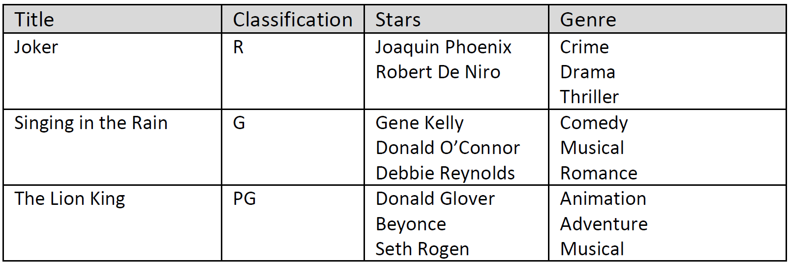
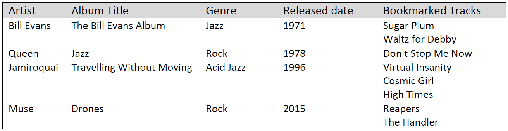

# XML Lab

## 1) Create a Valid XML document

Open a text editor like Notepad++ and create an XML document which stores the following data about films. It’s a good idea to save the XML to a file on your drive (e.g films.xml) before copying the text to the web link below.

### FILMS:



Create your XML document following this template:

```<?xml version="1.0" encoding="UTF-8"?>
<films>
    <film>
    	<title>...</title>
		    ...
    </film>
</films>
```

### Check your XML

Use a web browser to open the following page: `https://www.w3schools.com/xml/xml_validator.asp` Scroll down the page to the `Syntax-check Your XML` section and copy/paste your XML to validate it. If there is an error in the XML then check the debug information, and correct the XML. 

Once you have completed this task you can close this webpage and text editor (e.g. Notepad++).

## 2) XPath

We’ll now take a look at using XPath to filter an XML document with information about music albums as follows:


This dataset is available to download in XML from here: `http://www.macs.hw.ac.uk/~pb56/f21df.xml` Take a look at the XML document structure:

```
<?xml version="1.0" encoding="UTF-8"?>
<albums>
    <album>
        <artist>...</artist>
        ...
    </album>
</albums>
```

Copy across the XML data and write your XPath answers to the following questions here: `https://www.freeformatter.com/xpath-tester.html`

1. Get all the album titles
2. Show the artist for the last album on the list
3. Show all the details for the `'Jazz'` genre albums
4. Show the album title for those released before 1980 (not inclusive of 1980)
5. Show the bookmarked tracks for all `'Rock'` genre albums
6. Show a COUNT how many bookmarked tracks there are in total
7. Show the album title for records where 2 or more tracks have been bookmarked
8. Show a list of the album titles which include the word `'Album'` in the title
9. Show a list of the album title and artist with the 'Rock' genre

### HINTS:

Check the lecture notes for examples of XPath also check this link :
`https://www.w3schools.com/xml/xpath_syntax.asp`

```
									==========END OF THE LAB==========
```